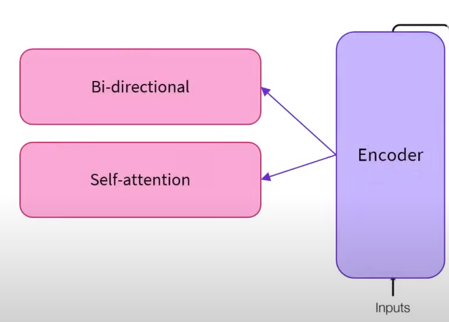
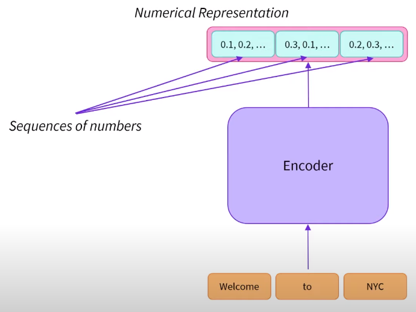
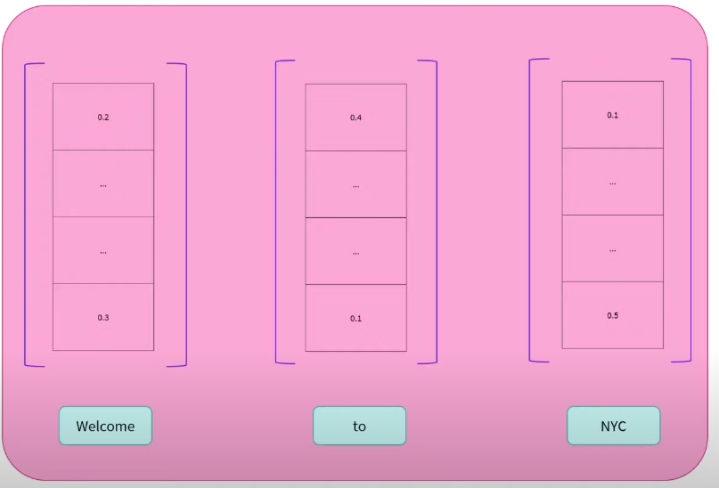
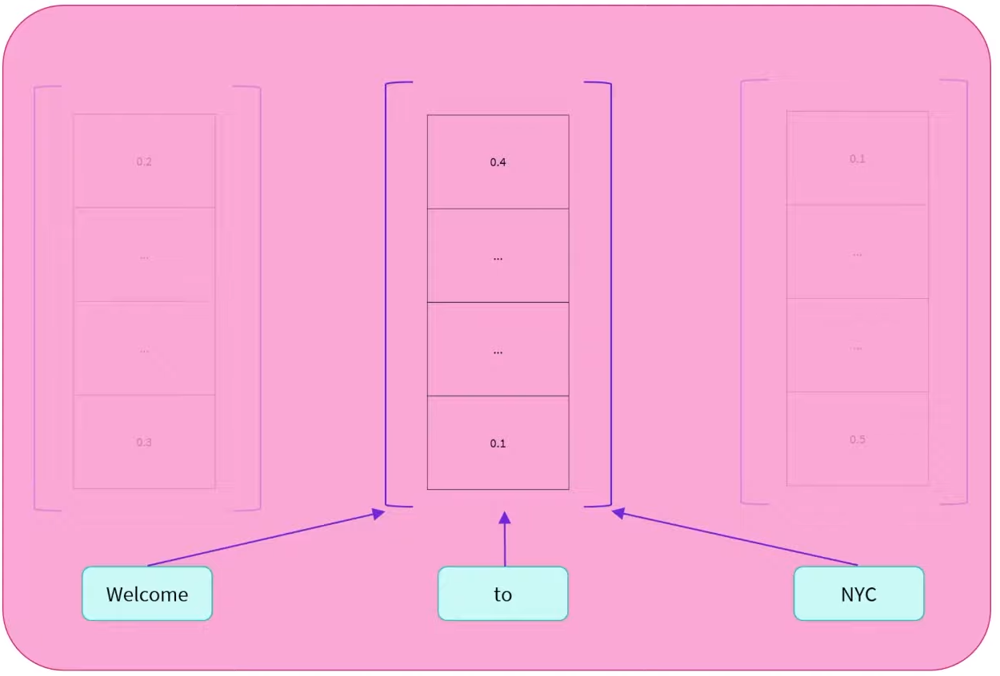

# Encoder models
They use only the **encoder** from the Transformer architecture. 

## How does it work

The encoder converts words into sequences of numbers (**feature vectors/tensors**):

It generates one **feature tensor** per word it was passed to the encoder.

The **dimension of the vector** is defined by **the architecture of the model**. 

The vector value is the numerical value of the word but **contextualized**. This means that is a representation of the word and its surrounding words (context). 

It is a contextualized value. As a result, the vector holds the word meaning within the text.
This is thanks to the **self-attention mechanism**. It Relays to different positions in a single text.

## Characteristics
At each stage: 
- **Attention layers** can access **all** the words in the initial sentence

The encoder models are: 
- Bidirectional context (given a word, it can look at both its right and left words)
- auto-encoding

## Pretraining
Corrupting a given sentence (i.e. masking it) and tasking the model with reconstructing the **initial sentence**.

## Tasks
Tasks that require an **understanding of the full sentence** and **relationships between words**.
- Sentence classification.
- Named Entity Recognition (NER).
- Extractive question answering.
- Question answering
- Masked language modeling.
- Sentiment analysis

## Representatives
- [ALBERT](https://huggingface.co/transformers/model_doc/albert.html)
- [BERT](https://huggingface.co/transformers/model_doc/bert.html)
- [DistilBERT](https://huggingface.co/transformers/model_doc/distilbert.html)
- [ELECTRA](https://huggingface.co/transformers/model_doc/electra.html)
- [RoBERTa](https://huggingface.co/transformers/model_doc/roberta.html)