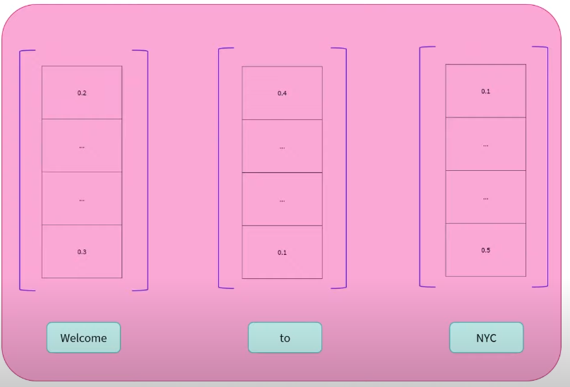

# Encoder models
They only use the **decoder** from the Transformer architecture. 

## How does it work
It can perform **most of the same tasks as an encoder**. This comes with a loss of performance. 

The decoder converts words into sequences of numbers (**feature vectors/tensors**):

It generates one **feature tensor** per word it was passed to the Decoder.

The **dimension of the vector** is defined by **the architecture of the model**. 

The vector value is the numerical value of the word but **single contextualized**. 

This means that is a representation of the word and the one on the left or on the right (**right or left context**). 

It is a **single contextualized** value. As a result, the vector holds the word meaning only taking into account either the **left or right** context.
This is thanks to the **masked self-attention mechanism**. It uses an additional mask in one of the sides of the word.

## Characteristics
At each stage: 
- **Attention layers** can access **the left or right words** in the initial sentence

The Decoder models are: 
- Unidirectional context (given a word, it can look at only its right or left words)
- Autoregressive (uses its pasts outputs as inputs for the following steps)

If a model like GPT-2 has 1024 context size, it means that it can still remember the previous 1024 previous words.
## Pretraining
Corrupting a given sentence (i.e. masking it) and tasking the model with reconstructing the **initial sentence**.

## Tasks
Text generation tasks:
- Causal language modeling (guessing next word in a sentence).

## Representatives
- [CTRL](https://huggingface.co/transformers/model_doc/ctrl.html)
- [GPT](https://huggingface.co/docs/transformers/model_doc/openai-gpt)
- [GPT-2](https://huggingface.co/transformers/model_doc/gpt2.html)
- [Transformer XL](https://huggingface.co/transformers/model_doc/transfo-xl.html)