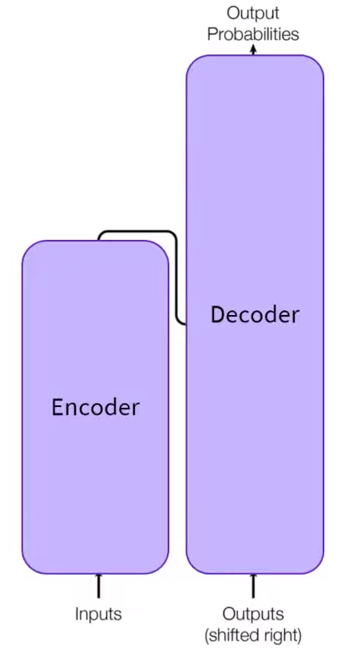
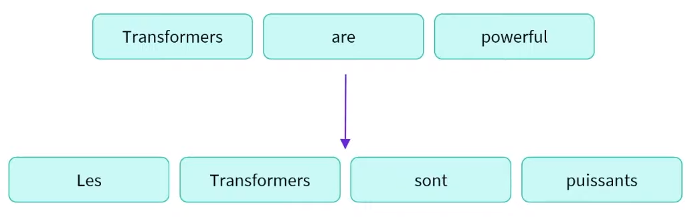
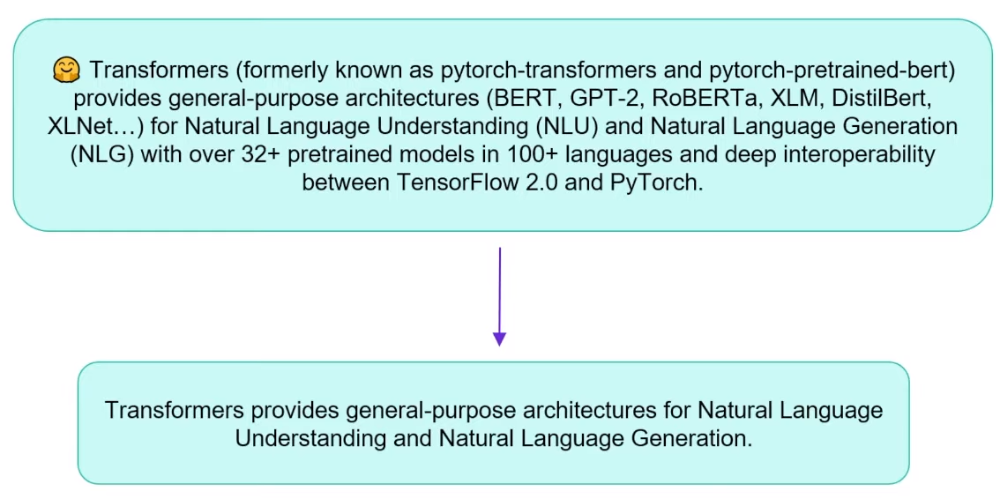
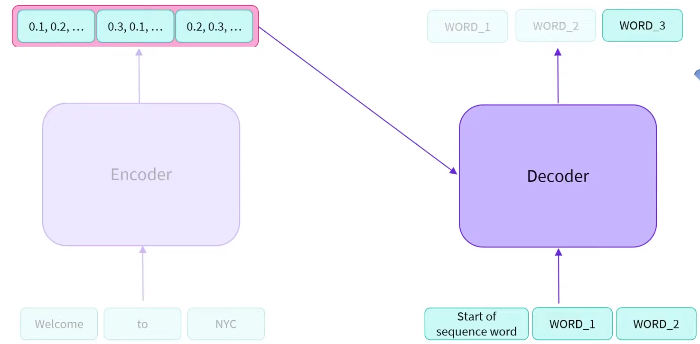
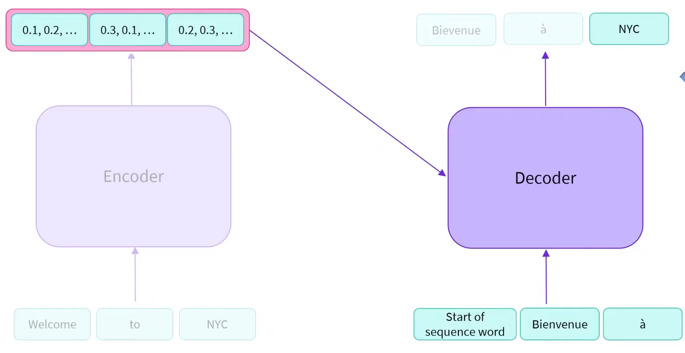
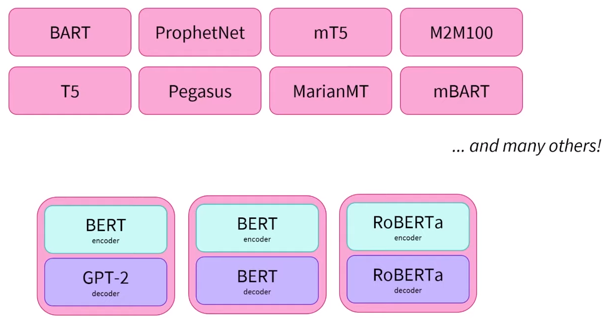

# Encoder-Decoder Models
Encoder-decoder models are the ones that use both the **Encoder** and the **Decoder**:

## Characteristics
- **Encoder** and **Decoder** usually **do not share** weights. 
- Input distribution != output distribution
### Tasks
Sequence to sequence tasks:
- Translation

- Summarization

- Generative question answering
### Encoder
Trained to **understand** the sequence and extract relevant information.

Example: 
- Understanding what was said in English language

### Decoder
Decode the **numerical representation** output by the **Encoder**. 

It can be specialized in other tasks (image generation per example)

## How does it work

1. The Encoder receives a **set of words** and transforms it into a set of **vectors per word**. As we already know from the **Encoders part**, each numerical representation **holds the value of the word in its given context**.
2. This set of numerical representations per word is used as **input** in the **Decoder**. Not only that but also, the Decoder receives a **start of sequence word** as input.
3. The Decoder outputs a **WORD_1** and uses it afterward as input (**autoregressive**) in combination with the **numerical representation** from the Encoder. It will keep on doing that until it generates a stopping word (e.g. '.').

A real life scenario would be with translation: 

### Combining Encoders and Decoders

We can make combinations of both Encoders and Decoders depending on our needs. 

## Representatives

- [BART](https://huggingface.co/transformers/model_doc/bart.html)
- [mBART](https://huggingface.co/transformers/model_doc/mbart.html)
- [Marian](https://huggingface.co/transformers/model_doc/marian.html)
- [T5](https://huggingface.co/transformers/model_doc/t5.html)