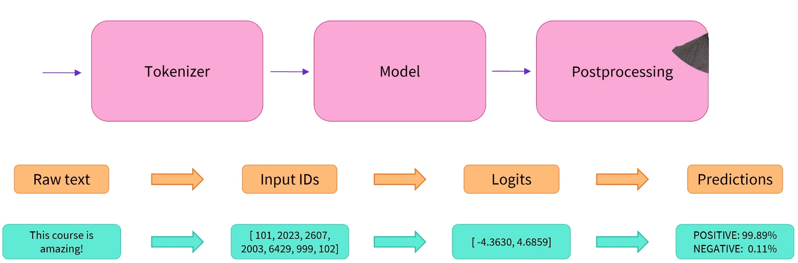
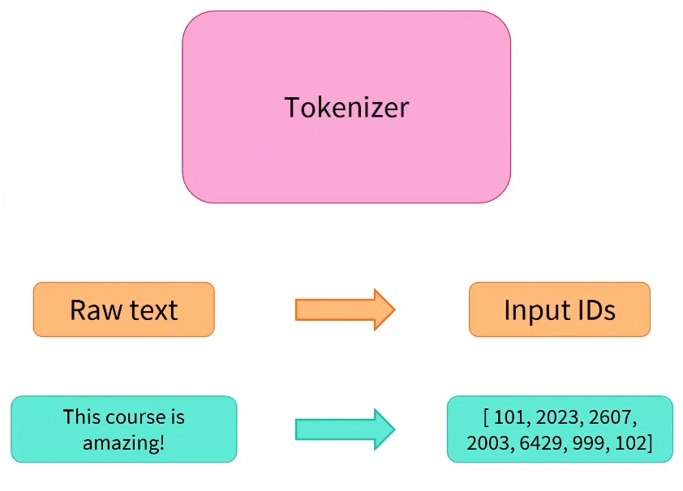
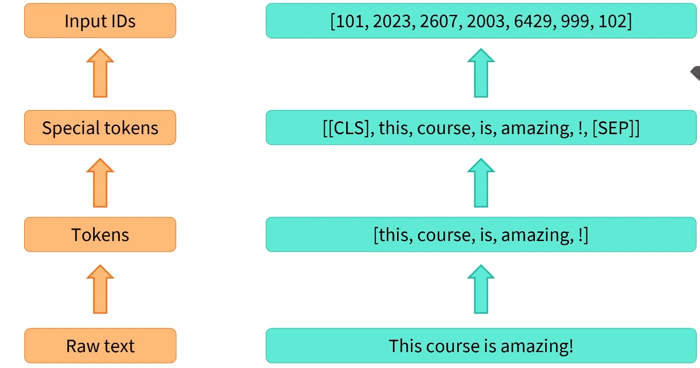
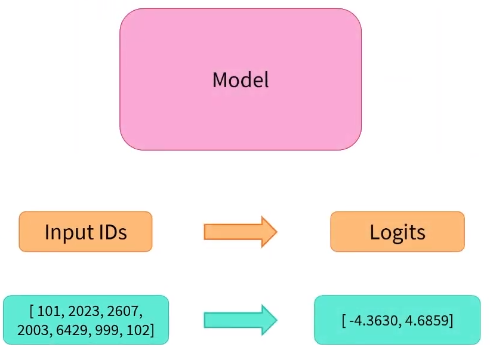
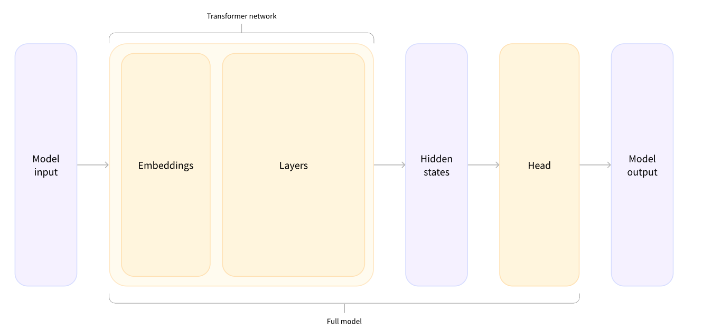
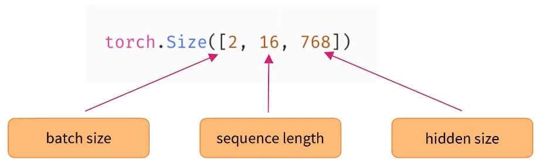
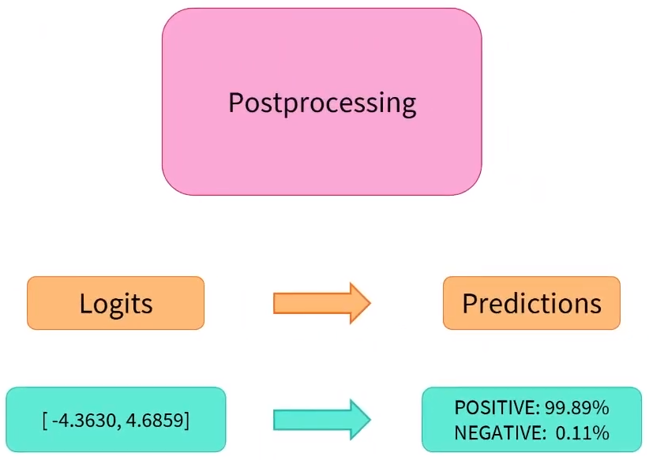

# What happens inside `pipeline()`

We have 3 stages:

## Tokenizer Stage

In the **Tokenization** process we have different steps: 

1. Tokenizer splits input text into small chunks called **Tokens** (they can be words, subwords or symbols).
2. Tokenizer adds **special tokens** that the model expect. 
3. Tokenizer maps each token to an integer value.

The only thing left is to: 
- Convert the list of input IDs to **tensors**

The **Transformer models** only accept **tensors**:
- They are like a NumPy array: 
    - Scalar: 0D
    - Vector: 1D
    - Matrix: 2D
    - ...
## Model Stage

By default, given some inputs, it **outputs** what we call *hidden states* or also known as *features*.

These *hidden states* are useful on their own, but they are usually **inputs** to another part of the model, known as **head**.
In the previous chapter, all tasks could have performed with **the same architecture**, but each of these tasks would have a **different head** associated. 

- **Embeddings layer**: Converts each input ID into a vector that represents the associated token
- **Layers**: Manipulate those vectors using **attention mechanisms** to produce the final representation.
  - **Hidden states**: 
    - A High-Dimensional vector. It represents the **contextual understanding of that input**. It is high-dimensional because of the **hidden size**
      
      - It has the following dimensions
        1. **Batch size**: Number of sequences processed at a time
        2. **Sequence Length**: Length of the numerical representation of the sequence
        3. **Hidden Size**:  Vector dimension of each model input

- **Head**: Takes the high-dimensional vectors and outputs the head result vector. They are called **Logits**. It refers to the unnormalized predictions generated by the model before applying the softmax function.
### Model architectures
- `*Model` (retrieve the hidden states)
- `*ForCausalLM`
- `*ForMaskedLM`
- `*ForMultipleChoice`
- `*ForQuestionAnswering`
- `*ForSequenceClassification`
- `*ForTokenClassification`
- and others 🤗

## Post Processing stage

The values we get as output from the model **don't necessarily** make sense.

They need to go through a [SoftMax Layer](https://en.wikipedia.org/wiki/Softmax_function). 

The Softmax layer is employed to convert logits into understandable probabilities. 

We also use cross-entropy, often used as the loss function, quantifies the dissimilarity between predicted probabilities and actual labels, guiding the training process towards better model performance.
### Softmax and Cross-Entropy in Classification

- **Softmax Layer:** The Softmax function is used to normalize the logits into a probability distribution across multiple classes. It ensures that the output probabilities range between 0 and 1, with their sum equal to 1. This step is crucial in generating probabilities for different classes.

- **Cross-Entropy Loss Function:** In classification tasks, the typical loss function used in conjunction with Softmax is cross-entropy. Cross-entropy measures the difference between the predicted probabilities (generated after the Softmax transformation) and the actual labels.

### Integration of Softmax into Cross-Entropy Loss

During training, the Softmax function is often integrated into the computation of the cross-entropy loss function. This integration allows for efficient computation by combining the Softmax transformation with the cross-entropy calculation. The goal is to minimize this combined loss function by adjusting the model's parameters (weights and biases) through optimization algorithms like gradient descent.

