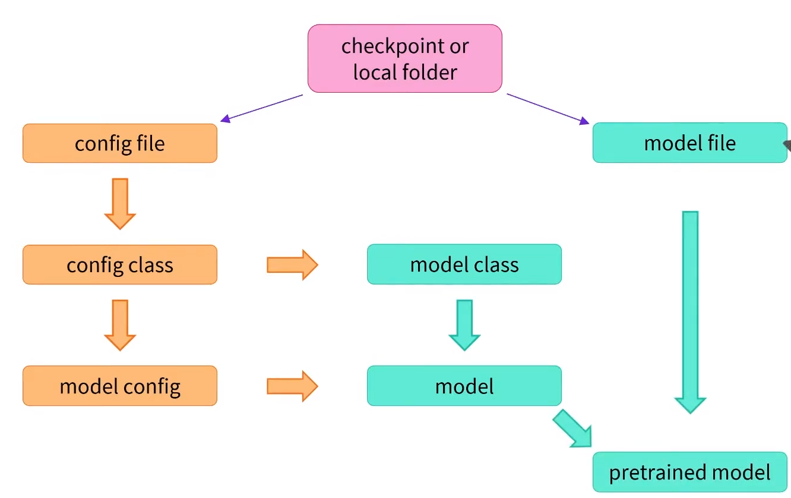

# Models

The `AutoModel` API allows you to instantatie a pretrained model from **any checkpoint**.
 
It’s a clever wrapper as it can automatically guess the appropriate model architecture for your checkpoint, and then instantiates a model with this architecture.


## Behind the `AutoModel.from_pretrained()`



It downloads and saves the **config file** and the **model file**.

### Config file

Blueprint of the configuration: 

```python
BertConfig {
  [...]
  "hidden_size": 768,
  "intermediate_size": 3072,
  "max_position_embeddings": 512,
  "num_attention_heads": 12,
  "num_hidden_layers": 12,
  [...]
}
```
