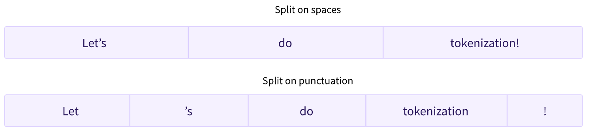
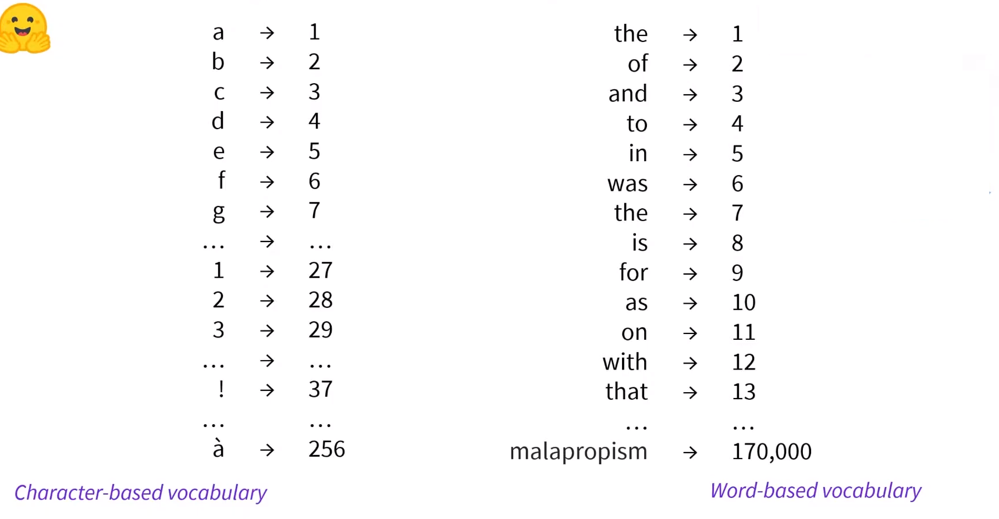
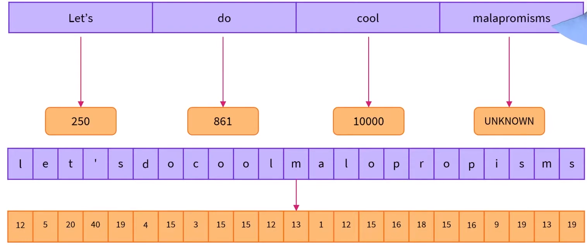
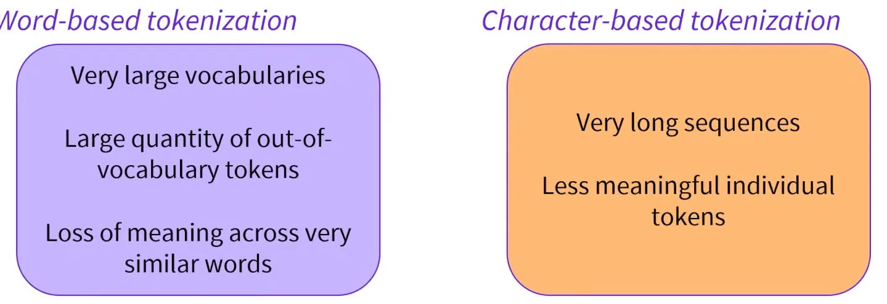
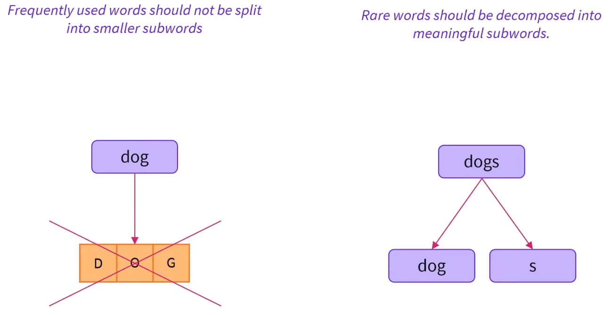
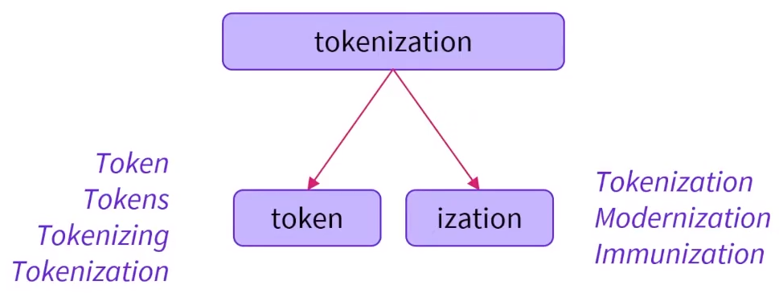

# Tokenizers
Their purpose is: 

- Translate text into data that can be processed by the model. 

This is because Models can only process numbers. 
## Word-Based Tokenizers
The goal is to split the raw text into words and find a numerical representation for each of them
There are different ways to split the text: 
- Split on spaces
- Split on punctuation (we can end up with large vocabularies*)

A Vocabulary is the total number of independent tokens we have in our corpus.

Each word gets assigned an ID, starting from 0 and going up to the size of the vocabulary. The model uses these IDs to identify each word.

If we want to completely cover a language with a word-based tokenizer, we’ll need to have an identifier for each word in the language, which will generate a huge amount of tokens.

- Words like “dog” are represented differently from words like “dogs”. The model will initially have no way of knowing that “dog” and “dogs” are similar.
- Custom token to represent words that are not in our vocabulary. This is known as the “unknown” token, often represented as : 
  - "[UNK]" 
  - "".
    - One way to reduce the amount of unknown tokens is to go one level deeper, using a **character-based tokenizer**.

## Character-Based Tokenizers
Split the text into characters, rather than words.

### Benefits
- Vocabulary is smaller
- Fewer unknown tokens. Every word can be built from characters.

### Cons
- Spaces
- Punctuation

Character tokens can seem less meaningful, but it depends on the language (in chinese a character carries more information than in latin languages).

## SubWord-Based Tokenizers

Both **Word-Based** and **Character-Based** Tokenizers have certain flaws:

The **SubWord-Based** Tokenizer is a mid-point between those two: 

Here is an example showing how a subword tokenization algorithm would tokenize the sequence “Let’s do tokenization!“:

### Benefits
- Relatively good coverage with small vocabularies, and close to no unknown tokens.
- Useful in agglutinative languages such as Turkish, where you can form (almost) arbitrarily long complex words by stringing together subwords.

### More subword tokenization

- **Byte-level BPE**, as used in GPT-2
- **WordPiece**, as used in BERT
- **SentencePiece or Unigram**, as used in several multilingual models

## Encoding
Translating text to numbers is known as *encoding*. It has two steps: 
1. **Tokenization**: Split the text into words (or parts of words, punctuation symbols, etc.), called tokens
2. **Conversion to input IDs**: Convert those tokens into numbers, so we can build a tensor out of them and feed them to the model

## Decoding
The other way around respect **Encoding**.